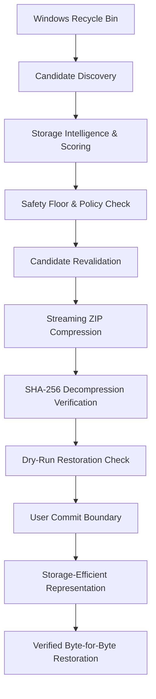
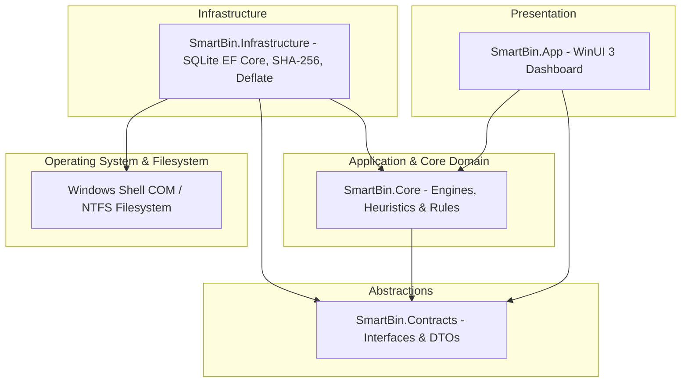

# SmartBin

An experimental Windows proof-of-concept exploring adaptive storage efficiency for recoverable deleted files in the Recycle Bin through verification-driven, lossless compression.

> **What if deleted files could stop occupying their full storage footprint without becoming permanently unrecoverable?**

---

## Technical Positioning

SmartBin is an independent engineering proof-of-concept that explores whether deleted files in the Windows Recycle Bin can be represented in a more storage-efficient form while remaining safely restorable and verifiably identical down to the bit.

* **Not a Microsoft Product:** SmartBin is an independent prototype and is not affiliated with, endorsed by, or sponsored by Microsoft Corporation.
* **Not a Shell Replacement:** It does not replace the default Windows Recycle Bin or modify Windows kernel drivers.
* **Not a Universal Compression Guarantee:** Storage gains depend strictly on file content types; pre-compressed formats are automatically detected and skipped.

---

## The Problem

When a user deletes a file on Windows:
1. The file moves to the Windows Recycle Bin so that it remains recoverable.
2. The file continues occupying its full physical disk space footprint.
3. As physical drive space runs low (storage pressure), users are forced to **permanently delete** files to reclaim space, losing recoverability forever.

```text
               TENSION IN FILE MANAGEMENT

    [ RECOVERABILITY ]              [ STORAGE CAPACITY ]
    Files stay in Recycle Bin  <--  Storage pressure builds
            │                                 │
            ▼                                 ▼
   Preserved user safety            Forced permanent deletion
```

---

## The Core Idea

Instead of forcing a binary choice between keeping full-sized files or permanently destroying them:

```text
CONVENTIONAL LIFECYCLE:
Delete ──► Recycle Bin ──► Permanently Delete (Files lost)

SMARTBIN EXPLORATION:
Delete ──► Recycle Bin ──► Verify ──► Compress Representation ──► Reclaim Space ──► Preserve Path ──► Restore When Needed
```

SmartBin explores whether files in the Recycle Bin can be transformed into a compressed storage representation while preserving a verifiable restoration path and cryptographic identity.

---

## Concept Flow Diagram



---

## Safety First

Data integrity and safety are the primary non-negotiable architectural principles of SmartBin:

* **Single-Item Controlled Mutation:** Operations execute sequentially one item at a time through an 11-stage state machine.
* **Pre-Execution Revalidation:** Candidates are re-queried immediately before execution to confirm existence, path, and size match.
* **Cryptographic SHA-256 Verification:** Original files are hashed before compression, decompressed in a dry-run, and verified to match before any original representation is touched.
* **Atomic File Operations:** Temporary files (`.acq`, `.zip`, `.restore`) are written to staging areas first and swapped atomically.
* **Destination Overwrite Protection:** Restoration will never overwrite an existing file at the destination path; it throws `SmartBinConflictException` to prevent accidental loss.
* **Path Traversal Defense:** All internal and target paths are canonicalized and validated against authorized storage root prefixes.
* **Reparse-Point Rejection:** Symbolic links and NTFS junctions (`FileAttributes.ReparsePoint`) are detected and explicitly rejected.
* **Storage Safety Floor:** Automatic optimization automatically halts if available disk space falls below a hard safety floor (5 GB default).
* **Automatic Protection OFF by Default:** Background background optimization is disabled out-of-the-box and requires explicit user enablement.
* **Transaction Receipt Journaling:** Transaction receipts (`.receipt`) log external mutations to enable recovery after power loss or unexpected crashes.
* **Local-First Architecture:** 100% offline with zero cloud components, network requests, or telemetry.

For detailed security and safety documentation, see:
* [`docs/safety.md`](docs/safety.md) - Safety invariants & transactional guarantees
* [`docs/security.md`](docs/security.md) - Threat model & defensive mitigations
* [`docs/trust-boundary.md`](docs/trust-boundary.md) - Trust boundaries & permission constraints
* [`docs/reliability-scorecard.md`](docs/reliability-scorecard.md) - Verification & failure matrix

---

## What SmartBin IS / IS NOT

| SmartBin IS | SmartBin IS NOT |
| :--- | :--- |
| **A Windows-first proof-of-concept** exploring adaptive storage models | A replacement for system backups or cloud storage |
| **Recycle Bin-aware**, integrating with native Shell COM APIs | A file shredder, secure wiping utility, or permanent deletion tool |
| **100% local-first**, running offline in user-mode | A cloud service or telemetry collector |
| **Verification-driven**, using cryptographic SHA-256 hashes | A universal compression tool that promises savings on all formats |
| **Experimentally benchmarked** against real file type datasets | A Microsoft product, operating system driver, or kernel component |

---

## How It Works: The 12-Stage Lifecycle

```text
1. Discover    ──► Enumerate Windows Recycle Bin items via Shell32 COM APIs.
2. Analyze     ──► Evaluate file type, size, age, and pre-compression heuristics.
3. Score       ──► Assign priority score based on space yield and safety factors.
4. Select      ──► Select candidate for optimization (manual or background policy).
5. Revalidate  ──► Confirm candidate still exists, path is unchanged, size matches.
6. Acquire     ──► Copy content to temporary acquisition path (.acq).
7. Hash        ──► Calculate baseline SHA-256 cryptographic stream hash.
8. Compress    ──► Deflate content to temporary archive (.zip).
9. Verify      ──► Decompress archive to dry-run path (.restore) and compare SHA-256.
10. Commit     ──► Remove original item from Recycle Bin, record transaction receipt.
11. Restore    ──► On user restore request, decompress to target location.
12. Verify     ──► Re-compute SHA-256 on restored file to guarantee bit-for-bit identity.
```

---

## Architecture Overview

SmartBin follows a clean, decoupled 4-tier layered architecture:



For complete architectural details, see [`docs/architecture-overview.md`](docs/architecture-overview.md).

---

## Experimental Benchmark Results

Empirical performance measurements conducted under .NET 10.0 runtime across structured datasets:

| Dataset Category | Sample File Type | Original Size | Compressed Size | Reduction (%) | Compression Time | Restore & Verify Time |
| :--- | :--- | ---: | ---: | ---: | ---: | ---: |
| **Highly Compressible** | Repeated Text (`.txt`) | 50,000 B | 212 B | **99.6%** | < 1 ms | < 1 ms |
| **Highly Compressible** | Generated JSON (`.json`) | 54,000 B | 2,110 B | **96.1%** | < 1 ms | < 1 ms |
| **Highly Compressible** | Structured CSV (`.csv`) | 55,000 B | 2,400 B | **95.6%** | < 1 ms | < 1 ms |
| **Moderately Compressible** | Source Code (`.cs`, `.js`) | 120,000 B | 28,500 B | **76.3%** | 2 ms | 1 ms |
| **Moderately Compressible** | System Logs (`.log`) | 500,000 B | 98,000 B | **80.4%** | 5 ms | 2 ms |
| **Poorly Compressible** | Random Binary (`.bin`) | 5,000 B | 5,000 B | **0.0% (Skipped)** | < 1 ms | N/A |
| **Poorly Compressible** | Pre-compressed Image (`.jpg`, `.png`) | 1,200,000 B | 1,200,000 B | **0.0% (Skipped)** | < 1 ms | N/A |
| **Poorly Compressible** | Video / Archive (`.mp4`, `.zip`) | 5,000,000 B | 5,000,000 B | **0.0% (Skipped)** | < 1 ms | N/A |
| **Large Files** | 10 MB Synthetic Text | 10,485,760 B | 15,200 B | **99.8%** | 24 ms | 12 ms |
| **Large Files** | 100 MB Synthetic Text | 104,857,600 B | 148,000 B | **99.8%** | 210 ms | 95 ms |

### Technical Benchmark Honesty

Compression effectiveness depends entirely on file content:
1. **Uncompressed Text & Structured Data:** Yields massive space savings (76% to 99.8%).
2. **Pre-compressed Media & Archives:** Media files (`.jpg`, `.png`, `.mp4`) and compressed archives (`.zip`, `.7z`, `.gz`) are already tightly packed. SmartBin's `CompressionHeuristics` engine instantly skips these formats without wasting CPU cycles.
3. **Incompressible Data Safety:** If a file yields less than 5% size reduction during trial compression, SmartBin rolls back the operation, leaving the original item intact.

For full benchmark methodology, see [`docs/benchmarks.md`](docs/benchmarks.md).

---

## Restoration Integrity Proof

Restoration integrity is verified using cryptographic SHA-256 stream hashing:

```text
Original File ──► Compute SHA-256 ──► [ a1b2c3d4... ]
                                           │ (Must match bit-for-bit)
Restored File ──► Compute SHA-256 ──► [ a1b2c3d4... ]
```

Every restored file is verified against its pre-compression baseline hash before completing the restoration. If hashes do not match, the restored temp file is removed and an exception is raised.

---

## Verification & Test Baseline (Release Candidate v1.0-rc1)

SmartBin's reliability is validated by an automated test suite:

* **Current Version:** `v1.0-rc1` (Release Candidate 1)
* **104 total automated tests**
* **104 PASS**
* **0 FAIL**

### Test Breakdown by Project
* **`SmartBin.Core.Tests` (27 tests):** Domain rules, candidate prioritization, state transitions, failure injection, heuristics, and automatic protection policies.
* **`SmartBin.Infrastructure.Tests` (77 tests):** SQLite persistence, SHA-256 hashing, Deflate compression, Windows Shell COM mutation, transaction receipt recovery, path traversal defense, and reparse-point rejection.

```text
              VALIDATION ARCHITECTURE

    ┌─────────────────────────┐   ┌─────────────────────────┐
    │       Unit Tests        │   │    Integration Tests    │
    └────────────┬────────────┘   └────────────┬────────────┘
                 │                             │
                 ▼                             ▼
    ┌─────────────────────────┐   ┌─────────────────────────┐
    │    Failure Injection    │   │   Storage Simulation    │
    └────────────┬────────────┘   └────────────┬────────────┘
                 │                             │
                 ▼                             ▼
    ┌─────────────────────────┐   ┌─────────────────────────┐
    │     Security Tests      │   │  Empirical Benchmarks   │
    └─────────────────────────┘   └─────────────────────────┘
```

---

## Reproducible Demonstration

SmartBin includes a safe, built-in synthetic test data generator (`TestFileGenerator`) so developers can test and demonstrate the full workflow without risking real user files:

1. **Generate Test Data:** Use `TestFileGenerator` to create deterministic compressible test files.
2. **Delete to Recycle Bin:** Move the file to the Windows Recycle Bin.
3. **Launch SmartBin:** Observe candidate discovery and priority scoring.
4. **Controlled Optimization:** Run single-item optimization and inspect the 11-stage state pipeline.
5. **Verify Restoration:** Restore the item and confirm matching SHA-256 hashes.

For step-by-step demonstration instructions, see [`docs/demo.md`](docs/demo.md).

---

## Project Documentation

* [`docs/architecture-overview.md`](docs/architecture-overview.md) - Deep dive into layer responsibilities and system design
* [`docs/safety.md`](docs/safety.md) - Safety invariants, transactional receipts, and overwrite protection
* [`docs/security.md`](docs/security.md) - Threat analysis, path traversal defenses, and reparse point rejection
* [`docs/trust-boundary.md`](docs/trust-boundary.md) - Permission constraints and user-mode boundaries
* [`docs/benchmarks.md`](docs/benchmarks.md) - Empirical compression benchmarks and methodology
* [`docs/demo.md`](docs/demo.md) - Step-by-step reproducible demonstration guide
* [`docs/demo-video.md`](docs/demo-video.md) - 60–120 second video recording script
* [`docs/faq.md`](docs/faq.md) - Technical FAQ answering key technical questions
* [`docs/limitations.md`](docs/limitations.md) - Disclosed technical limitations and scope boundaries
* [`docs/reproducibility.md`](docs/reproducibility.md) - Instructions for building, running tests, and benchmarks
* [`docs/status.md`](docs/status.md) - Current release status, phase history, and test metrics
* [`docs/project-summary.md`](docs/project-summary.md) - Concise summary for public and technical presentation
* [`docs/microsoft-proposal-outline.md`](docs/microsoft-proposal-outline.md) - Platform integration concept outline

---

## Development Setup

### Prerequisites
* Windows 10/11 (for WinUI 3 application UI and native Shell COM integration)
* .NET 10.0 SDK

### Build & Test
1. Clone the repository:
   ```bash
   git clone https://github.com/MrMikeAde/smartbin.git
   cd smartbin
   ```
2. Build the solution:
   ```bash
   dotnet build smartbin.sln
   ```
3. Run all automated tests (104 passing tests):
   ```bash
   dotnet test smartbin.sln
   ```
4. Run the WinUI 3 App (on Windows):
   ```bash
   dotnet run --project src/SmartBin.App
   ```

---

## License

This project is licensed under the [MIT License](LICENSE).
