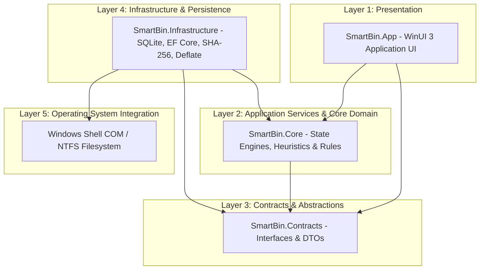
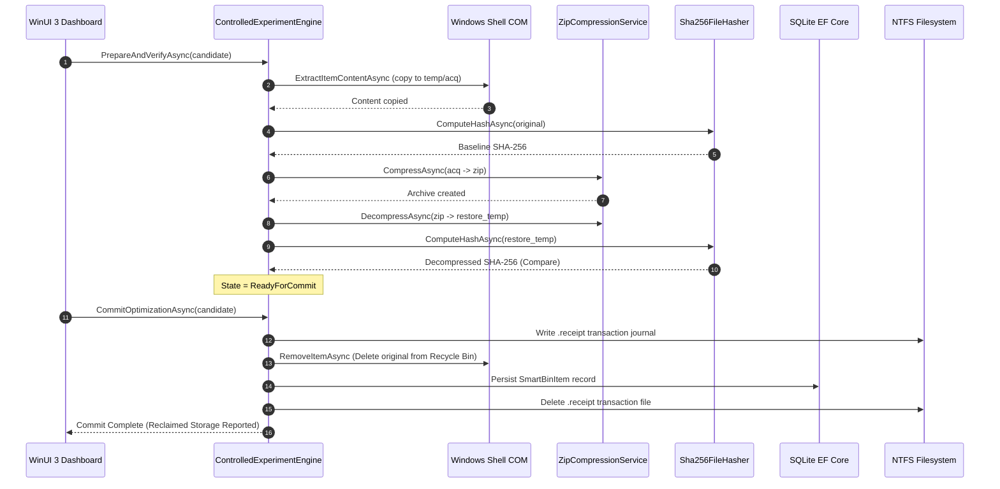

# SmartBin Architectural Overview

This document provides a detailed technical breakdown of SmartBin's system design, layer boundaries, dependency rules, and trust boundaries.

---

## 1. System Layers & Dependency Rules

SmartBin strictly adheres to clean architectural layer isolation:



### Layer Responsibilities

#### 1. Presentation (`SmartBin.App`)
* **Technology:** WinUI 3 (Windows App SDK), XAML, Fluent Design.
* **Responsibilities:** Interactive dashboard, real-time storage pressure gauge, controlled experiment UI, settings controls, activity log stream, and onboarding guidance.
* **Rule:** Contains no business or compression logic; delegates all operations to core service contracts.

#### 2. Domain & Application Logic (`SmartBin.Core`)
* **Technology:** Pure C# / .NET 10.
* **Responsibilities:** Candidate analysis, priority scoring, heuristics evaluation, controlled state machine (`ControlledExperimentEngine`), automatic protection engine (`AutomaticProtectionEngine`), crash recovery (`CrashRecoveryService`), and synthetic test data generation (`TestFileGenerator`).
* **Rule:** Has zero dependencies on WinUI 3 or platform-specific UI frameworks.

#### 3. Abstractions (`SmartBin.Contracts`)
* **Technology:** Pure C# / .NET 10.
* **Responsibilities:** Service interfaces (`ISmartBinRepository`, `IRecycleBinProvider`, `IRecycleBinMutationService`, `ICompressionEngine`, `IStoragePressureMonitor`, `IRestoreService`, `IFailureInjector`), domain DTOs, and exception definitions.
* **Rule:** Zero external dependencies. Defines contracts implemented by Infrastructure and consumed by Core/App.

#### 4. Infrastructure & OS Integration (`SmartBin.Infrastructure`)
* **Technology:** SQLite EF Core 9.0, `System.IO.Compression`, Cryptography, Win32 P/Invoke, Native Windows Shell COM (`Shell32.Shell`).
* **Responsibilities:** Persistence of metadata in SQLite, streaming Deflate compression, SHA-256 file hashing, P/Invoke power state queries (`GetSystemPowerStatus`), and non-elevated Shell COM verb mutation.

---

## 2. Complete End-to-End Data Pipeline



---

## 3. Trust Boundary & Security Boundaries

```text
  [ USER LAND / NON-ELEVATED PRIVILEGES ]
  ┌─────────────────────────────────────────────────────────────┐
  │ SmartBin.App (WinUI 3 Shell)                                 │
  │   │                                                         │
  │   ▼                                                         │
  │ SmartBin.Core Engine                                        │
  │   ├── Storage Root Validation (Canonical Path StartsWith)   │
  │   ├── Reparse Point Check ((attr & ReparsePoint) == 0)      │
  │   └── SHA-256 Hash Verification                             │
  │                                                             │
  └──────────────────────────────┬──────────────────────────────┘
                                 │ Standard User File I/O
                                 ▼
  ┌─────────────────────────────────────────────────────────────┐
  │ Local Storage Area (%LocalAppData%/SmartBin)                │
  │   ├── smartbin.db (SQLite Metadata)                         │
  │   ├── objects/ (Compressed .zip representations)            │
  │   └── temp/ (Acquisition & Restoration staging)             │
  └─────────────────────────────────────────────────────────────┘
```

1. **User Mode Restrictions:** SmartBin operates strictly within standard non-elevated user permissions. It never prompts for UAC elevation or executes administrative actions.
2. **Canonical Path Validation:** Every file path is normalized via `Path.GetFullPath` and verified to reside inside the canonical `GetStoragePath()` directory prefix to eliminate path traversal risks.
3. **Reparse Point Guard:** Files exhibiting `FileAttributes.ReparsePoint` (symlinks, junctions) are rejected to prevent link manipulation attacks.
